## Part 1. Установка ОС
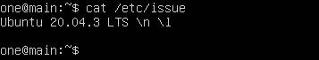

## Part 2. Создание пользователя
- root-права: sudo -i
- Добавление юзера: adduser %name%
- Выдача прав: usermod -aG adm %name%

- Сменить юзера: su %name%

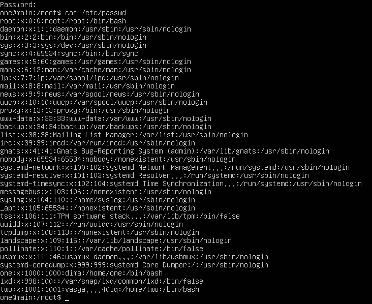

## Part 3. Настройка сети ОС
- Имя сервера: hostname
- Сменить имя: nano/vi /etc/hostname

##### Задать название машины:

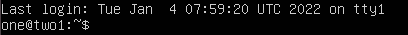

##### Задать временной пояс:
- ls /usr/share/zoneinfo/
- ln -sf /usr/share/zoneinfo/Asia/Novosibirsk /etc/localtime
- посмотреть дату: date

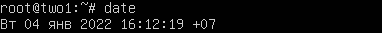

##### Названия сетевых интерфейсов:
- ifconfig -a

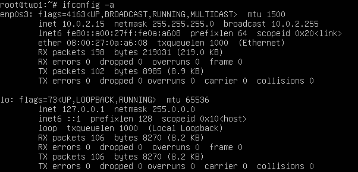

- lo — это локальная петля, которая имеет IP-адрес 127.0.0.1 и предназначена для сетевого доступа к своему же компьютеру.
- удалить ранее присвоеный ip: dhclient -r
- выделить новый: dhclient
- DHCP выполняет всю работу по подбору сетевых настроек автоматически, без необходимости присваивать вручную каждому устройству свой IP-адрес.

##### Определить и вывести
- Инфа о шлюзе: route -n

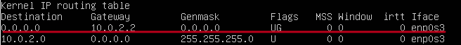

##### Задать статичные ip gw dns
- открываем файл с параметрами: vi /etc/netplan/*.yaml
- добавляем статик ip и dns

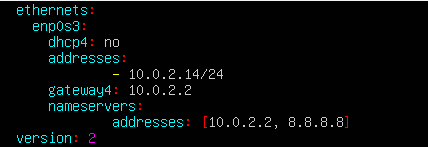

- netplan apply
- reboot
- ip -r

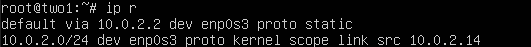

##### Пропинговать

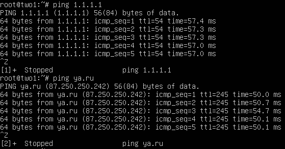

## Part 4. Обновление ОС
- apt-get update
- apt-get dist-upgrade

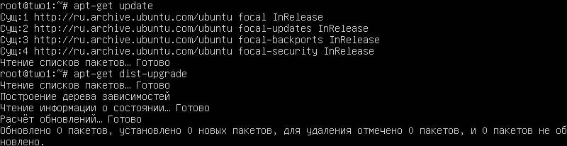

## Part 5. Использование команды sudo
- Выдача прав: usermod -aG sudo %name%

- sudo - команда которая позволяет вам запускать программы от имени суперпользователя.
- переключение на другого юзера: su two
- Сменить имя: sudo vi /etc/hostname

## Part 6. Установка и настройка службы времени
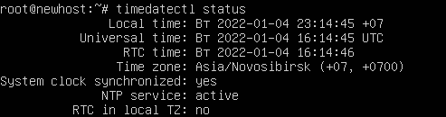

## Part 7. Установка и использование текстовых редакторов
- apt install %program%

##### VIM

- для выхода с сохр. команда: ":wq"

##### NANO
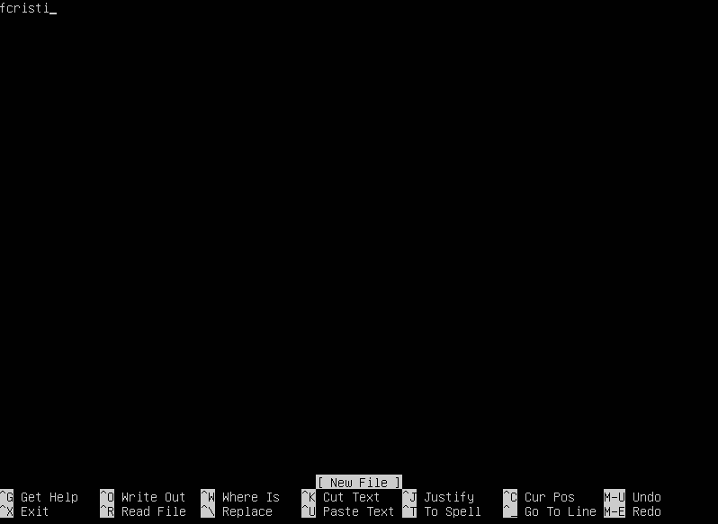
- для выхода комбинация клавиш: ctr + X и подтверждение изменений

##### JOE

- для выхода комбинация клавиш: ctr + K и ввод Q, затем подтверждение изменений

##### VIM

- для выхода без сохр. команда: ":q!"

##### NANO
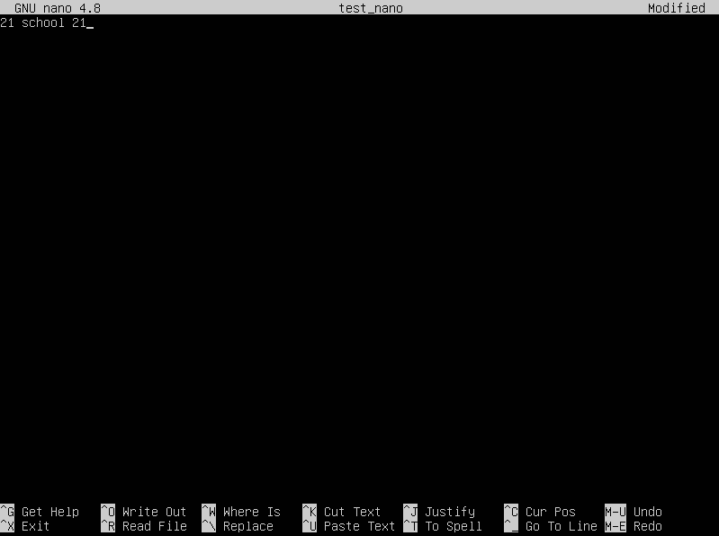
- для выхода комбинация клавиш: ctr + X и НЕ подтверждение изменений

##### JOE
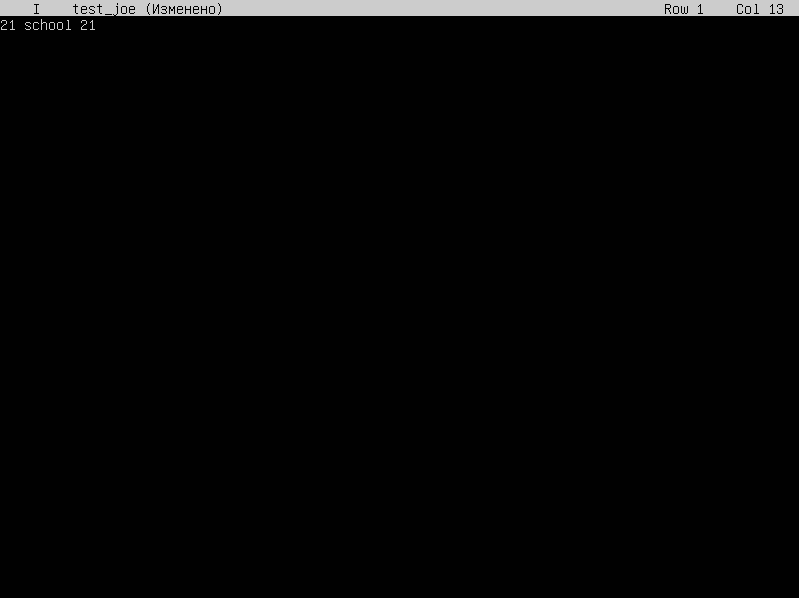
- для выхода комбинация клавиш: ctr + K и ввод Q, затем НЕ подтверждение изменений

##### VIM
- для поиска слова: "/слово"

- для замены слова: ":s/слово/замена"

##### NANO
- для поиска комбинация клавиш: ctr + W

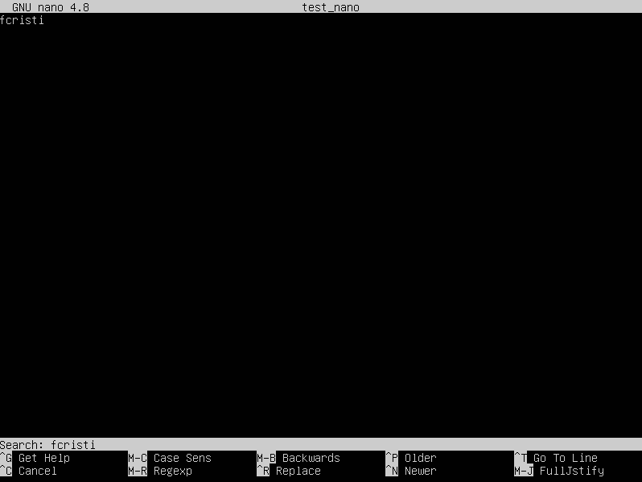

- для замены комбинация клавиш: ctr + W и затем ctr + R

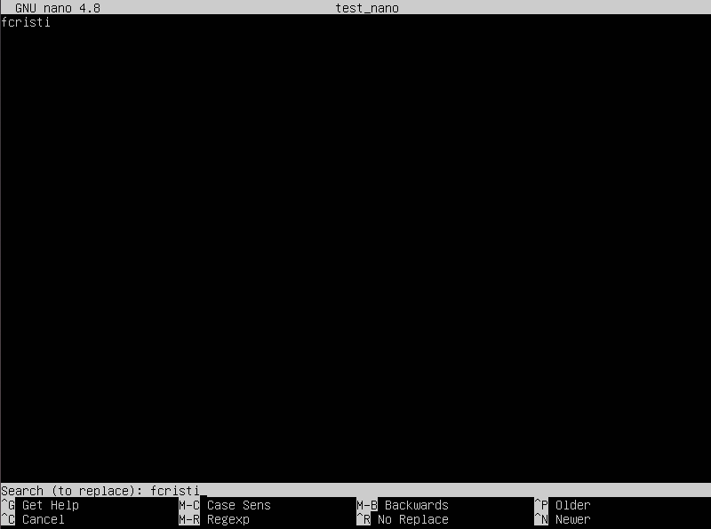

##### JOE
- для поиска комбинация клавиш: ctr + K и ввод K

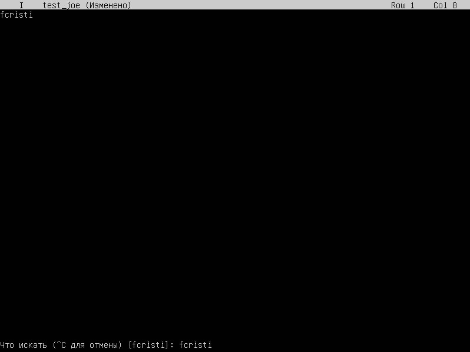

- для замены комбинация клавиш: ctr + K и ввод K и затем ввод R

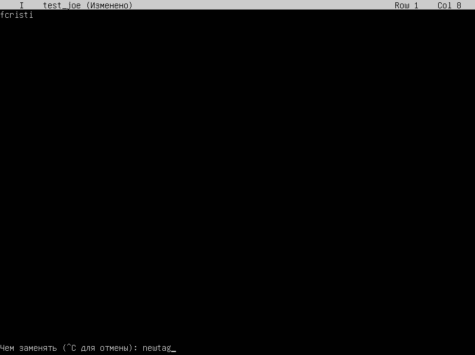

## Part 8. Установка и базовая настройка сервиса SSHD

##### Установить службу SSHd
- apt update
- apt install openssh-server

##### Проверить статус работы SSHd
- systemctl status ssh - статус работы службы
- systemctl enable ssh - добавление в автозагрузку

##### Перенастроить службу SSHd на порт
- vim /etc/ssh/sshd_config
- меняем "#port 22" на "port 2022"
- перезапуск службы service ssh restart

##### Показать наличие процесса sshd
- ps ключ "-e" для отображения всех процессов | greb ssh - для вывода только процесса ssh
- ps команда для отслеживания активных процессов в системе

##### Вывод команды netstat -tan
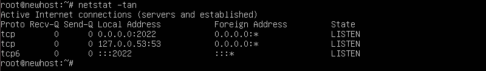

- "-t" - Отображение текущего подключения в состоянии переноса нагрузки с процессора на сетевой адаптер при передаче данных ( "offload" )
- "-a" - Отображение всех подключений и ожидающих портов
- "-n" - Отображение адресов и номеров портов в числовом формате
- proto - сетевой протокол
- Recv-Q - Количество байтов, не скопированных программой пользователя, подключенной к этому сокету.
- Send-Q - Количество байтов, не подтвержденных удаленным хостом
- Local Adress - Локальный адрес
- Foreign Adress - Адрес и номер порта удалённого конца сокета
- LISTEN - Ожидает входящих соединений
- Значение 0.0.0.0 - это означает - "любой адрес", т. е в соединении могут использоваться все IP-адреса существующие на данном компьютере

## Part 9. Установка и использование утилит top, htop
- apt install htop

##### TOP
- uptime
- количество авторизованных пользователей
- общую загрузку системы
- общее количество процессов
- загрузку cpu
- загрузку памяти

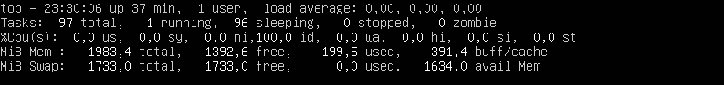

- pid процесса занимающего больше всего памяти: 1
- pid процесса, занимающего больше всего процессорного времени: 1202

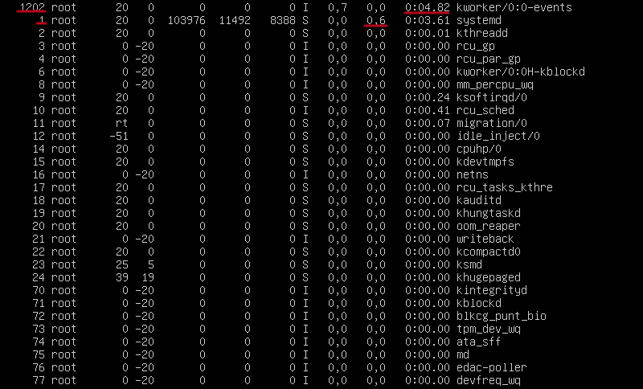

##### HTOP
- PID SORT

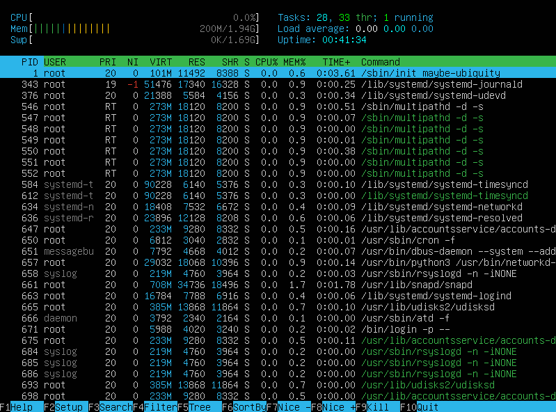

- PERCENT_CPU SORT

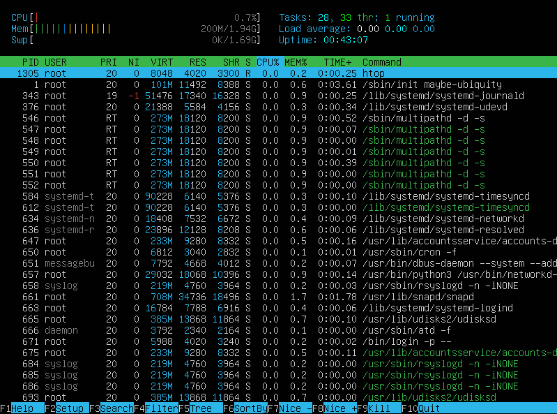

- PERCENT_MEM SORT

- TIME SORT

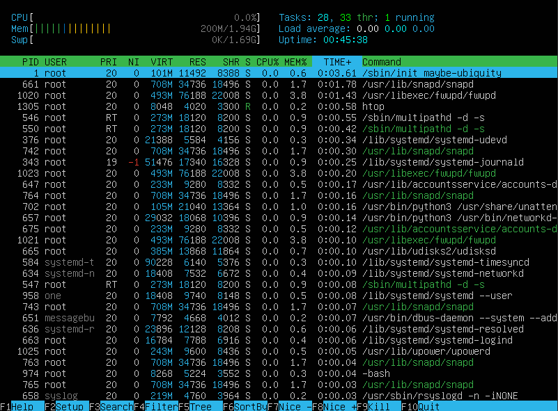

- отфильтрованному для процесса sshd

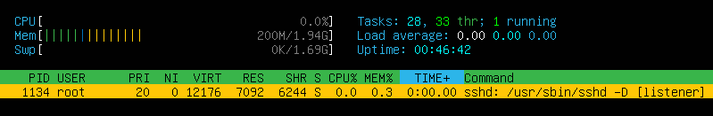

- с процессом syslog, найденным, используя поиск

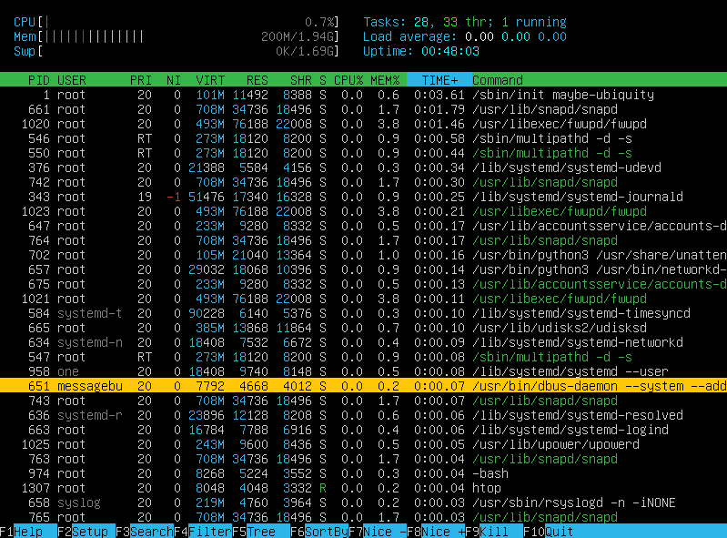

- с добавленным выводом hostname, clock и uptime

## Part 10. Использование утилиты fdisk
- Название VBOX HARDDISK
- Кол-во секторов: 20971520
- судя по инфе fdisk -l /dev/sda swap раздел отсутствует

## Part 11. Использование утилиты df

##### Запустить команду df
- Размер корневого раздела: 8731376
- Размер занятого пространства: 4946332
- Размер свободного пространства: 3785044
- Процент использования: 57%

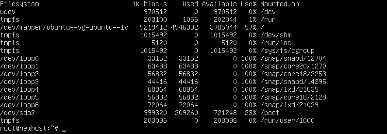

- Единица измерения: Килобайт

##### Запустить команду df -Th
- Размер корневого раздела: 8.5G
- Размер занятого пространства: 4.8G
- Размер свободного пространства: 3.7G
- Процент использования: 57%
- Тип файловой системы: журналируемая файловая система ext4

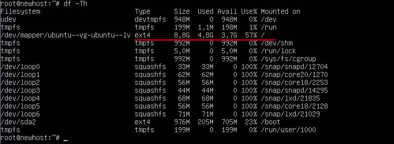

## Part 12. Использование утилиты du
- du -sB KB /home /var /var/log

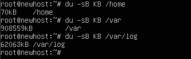

- du -B KB /var/log

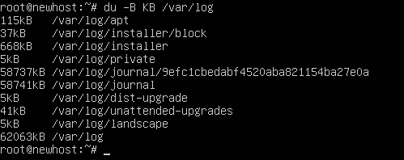

## Part 13. Установка и использование утилиты ncdu
-apt install ncdu

- ncdu /home

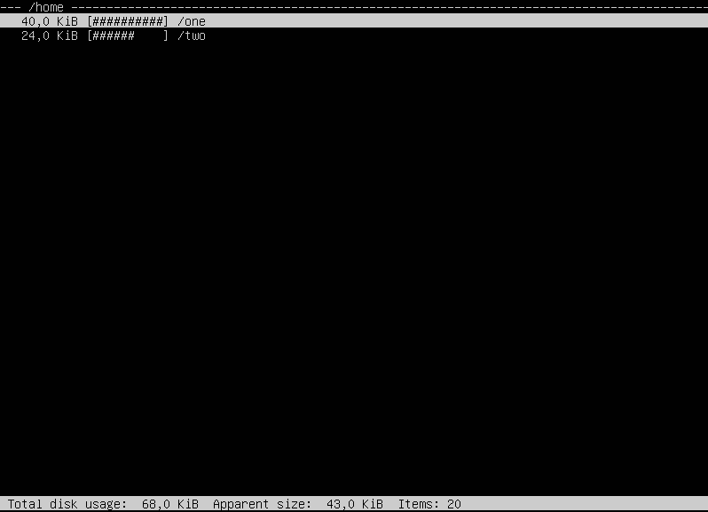

- ncdu /var

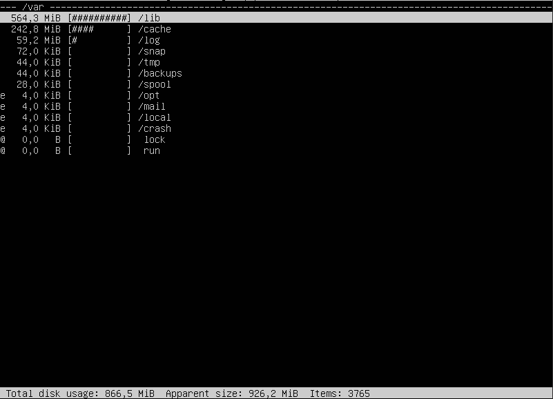

- ncdu /var/log

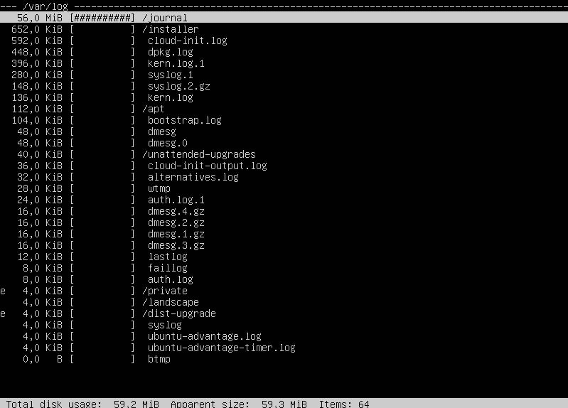

## Part 14. Работа с системными журналами

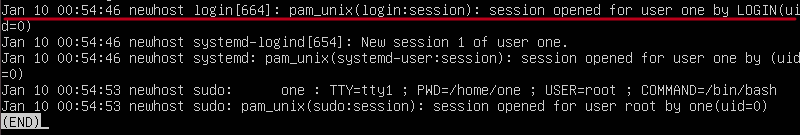

- systemctl restart sshd

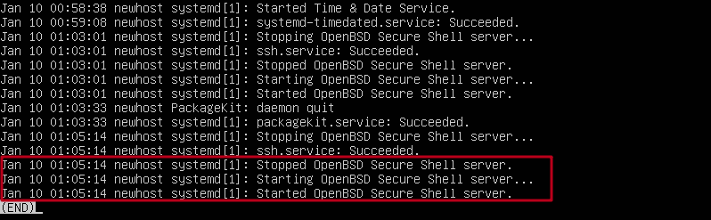

## Part 15. Использование планировщика заданий CRON
- Cоздание файла расписания: crontab -e

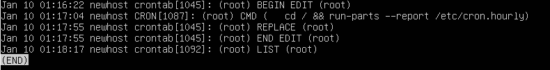

- Вывод содержимого расписания: crontab -l

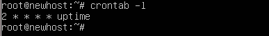

- Отработка планировщика

- Удаление содержимого расписания: crontab -r

